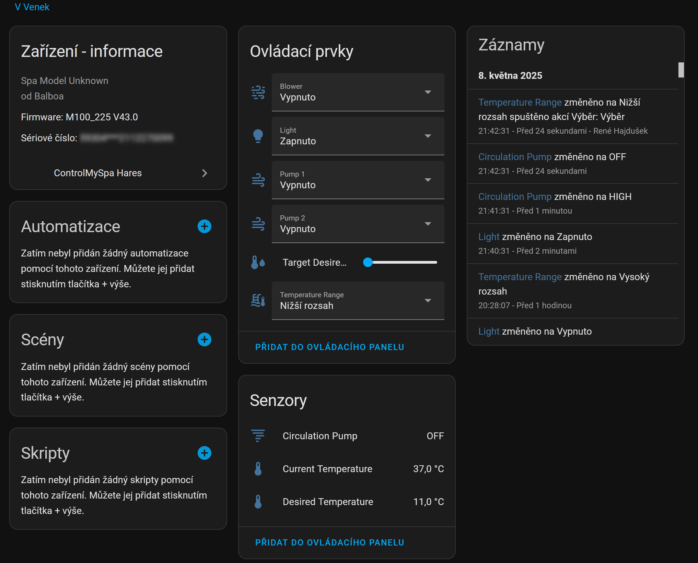

# ControlMySpa Hares pro Home Assistant (experimentální)

Tato komponenta umožňuje integraci a ovládání vířivek prostřednictvím platformy Home Assistant. Poskytuje pokročilé funkce, které nejsou dostupné ve standardních integracích, a je určena pro uživatele s konkrétními potřebami nebo pro ty, kteří chtějí testovat nové funkce.

## Hlavní funkce:
- **Monitorování stavu vířivky**:
  - Zobrazení aktuální teploty vody.
  - Zobrazení požadované teploty vody.
  - Informace o stavu cirkulačního čerpadla, světel a dalších komponent.

- **Ovládání vířivky**:
  - Nastavení požadované teploty vody.
  - Přepínání mezi vysokým a nízkým teplotním rozsahem.
  - Ovládání světel, čerpadel a vzduchových bublin.

- **Automatizace**:
  - Možnost integrace s automatizacemi Home Assistantu pro plánování a řízení vířivky na základě podmínek, jako je čas, počasí nebo přítomnost uživatelů.

## Upozornění:
Tato komponenta je experimentální a může obsahovat funkce, které nejsou plně otestovány. Používejte ji na vlastní riziko.
Toto je můj první projekt pro Home Assistant. Prosím o schovívavost ohledně funkčnosti a případných nedostatků. Pokud narazíte na chyby nebo máte návrhy na zlepšení, neváhejte mě kontaktovat nebo vytvořit issue na GitHubu. Děkuji za pochopení a podporu!

## Zaregistrovat komponentu jako HACS custom repository

Pokud chcete tuto komponentu přidat prostřednictvím HACS (Home Assistant Community Store), postupujte podle následujících kroků:

1. Otevřete Home Assistant a přejděte do **HACS** → **Integrations**.
2. Klikněte na **Menu** (3 tečky v pravém horním rohu) → **Custom repositories**.
3. Do pole **Repository** zadejte URL vašeho GitHub repozitáře.
4. V poli **Category** vyberte možnost **Integration**.
5. Klikněte na **Add**.

Po přidání repozitáře se komponenta objeví v seznamu HACS integrací a můžete ji nainstalovat přímo odtud.

# ControlMySpa Hares for Home Assistant (experimental)

This component allows integration and control of spas through the Home Assistant platform. It provides advanced features not available in standard integrations and is intended for users with specific needs or those who want to test new features.

## Key Features:
- **Spa Monitoring**:
  - Display the current water temperature.
  - Display the desired water temperature.
  - Information about the status of the circulation pump, lights, and other components.

- **Spa Control**:
  - Set the desired water temperature.
  - Switch between high and low temperature ranges.
  - Control lights, pumps, and air bubbles.

- **Automation**:
  - Integrate with Home Assistant automations to schedule and manage the spa based on conditions such as time, weather, or user presence.

## Disclaimer:
This component is experimental and may include features that are not fully tested. Use it at your own risk.
This is my first project for Home Assistant. Please be patient regarding functionality and potential shortcomings. If you encounter any issues or have suggestions for improvement, feel free to contact me or create an issue on GitHub. Thank you for your understanding and support!

## Register the component as a HACS custom repository

If you want to add this component via HACS (Home Assistant Community Store), follow these steps:

1. Open Home Assistant and navigate to **HACS** → **Integrations**.
2. Click on **Menu** (three dots in the top-right corner) → **Custom repositories**.
3. In the **Repository** field, enter the URL of your GitHub repository.
4. In the **Category** field, select **Integration**.
5. Click **Add**.

Once the repository is added, the component will appear in the list of HACS integrations, and you can install it directly from there.

