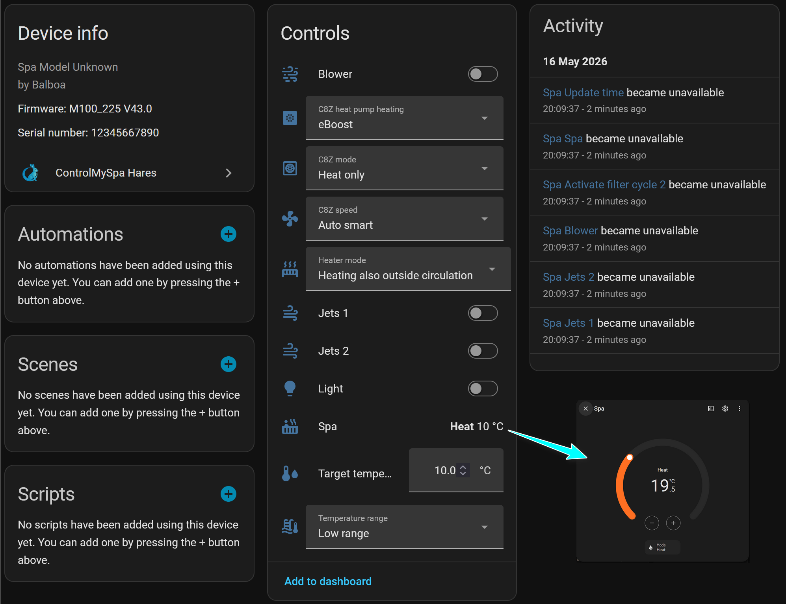
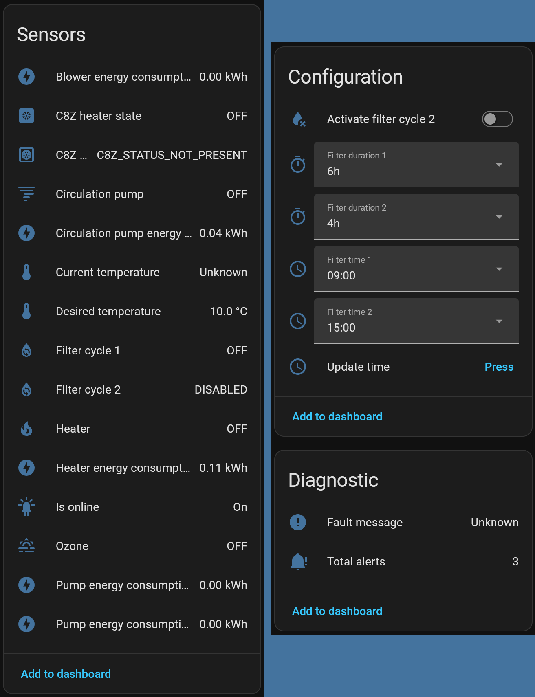
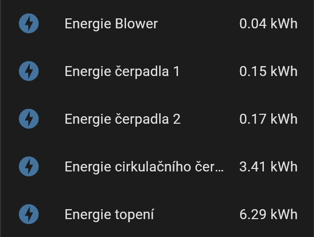
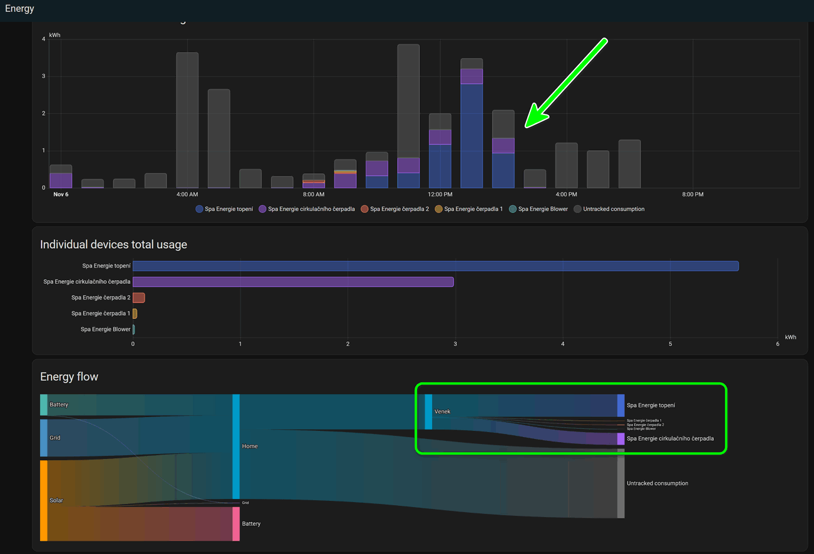
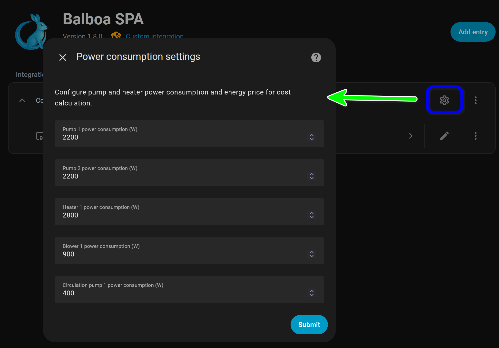
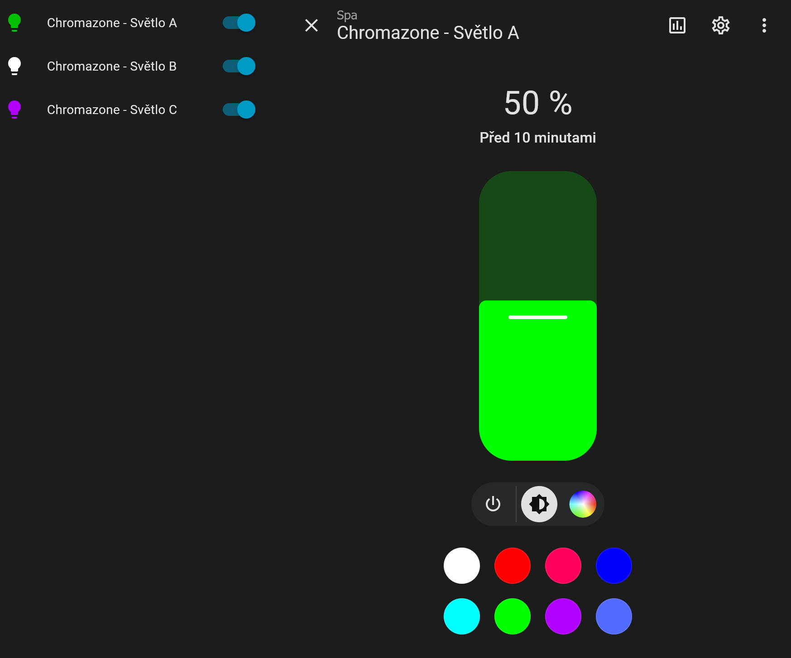
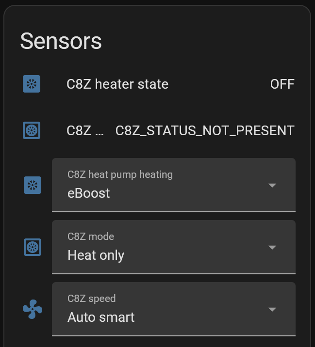

# ControlMySpa Hares for Home Assistant *(experimental)*

Connect your hot tub to Home Assistant using the same **ControlMySpa** cloud account as the official mobile app. This custom integration adds extra monitoring and control options beyond the standard integration — ideal if you want more detail, energy estimates, **Chromazone** lighting, or **Clim8Zone** heat pump control in HA.

If you find it useful, you can support development here:  
[](https://buymeacoffee.com/haresoft)

---

## What you need

- A **ControlMySpa** account (same login as the mobile app)
- Home Assistant with **HACS** (recommended) or manual install
- Your spa reachable via the ControlMySpa cloud (internet connection required)

> **Note:** Communication goes through the cloud — not directly over your local network. Behaviour is similar to the mobile app: changes are not instant.

---

## Installation

After installation (either method below), add the integration under **Settings** → **Devices & services** → **Add integration** → **ControlMySpa Hares**.

### Option A — HACS *(recommended)*

1. In Home Assistant, open **HACS** → **Integrations**.
2. Open the menu (⋮) → **Custom repositories**.
3. Add repository: `https://github.com/haresik/Hares-ControlMySpa.git`
4. Category: **Integration** → **Add**.
5. Install **ControlMySpa Hares** from the integration list.
6. **Restart Home Assistant** when prompted (or restart manually).

### Option B — Manual copy

If you do not use HACS, copy the integration folder into your Home Assistant configuration directory:

1. Download the repository ([ZIP from GitHub](https://github.com/haresik/Hares-ControlMySpa/archive/refs/heads/main.zip) or `git clone`).
2. Copy the entire folder  
   `custom_components/control_my_spa`  
   into your HA config folder so the path is:  
   `config/custom_components/control_my_spa/`  
   (same level as `configuration.yaml`).
3. The folder must contain `manifest.json` and the other integration files — not the whole GitHub repo root.
4. **Restart Home Assistant** (full restart, not only “reload YAML”).
5. Add the integration as described above.

**Example** (Samba / File editor / SSH):

```text
/config/
  configuration.yaml
  custom_components/
    control_my_spa/          ← this folder from the repo
      __init__.py
      manifest.json
      …
```

For updates with manual install, replace the `control_my_spa` folder with the new version and restart Home Assistant again.

---

## First-time setup

During setup you will:

1. Enter your **ControlMySpa username and password**.
2. Choose **how often** Home Assistant should refresh spa data (default: every **1 minute**).
3. Pick **which spa** to add if your account has more than one.

After setup, open the spa device in Home Assistant. The entities you see depend on **your spa model** — not every tub has Chromazone lighting, a Clim8Zone heat pump, a second filter, or multi-speed jets.

### Integration options

Under **Configure** on the integration you can tune:

- **Power (W)** for each heater, jet pump, blower, and circulation pump — used for **estimated** energy consumption (see below).

Default power values if you do not change anything:

| Component            | Default |
|----------------------|--------:|
| Heater               | 2800 W  |
| Jet pump             | 2200 W  |
| Blower               | 900 W   |
| Circulation pump     | 400 W   |

Adjust these to match your hardware if you want more realistic energy numbers.

---

## How control works (good to know)

When you change something in Home Assistant:

1. The command is sent to the **ControlMySpa cloud**.
2. The cloud forwards it to your spa.
3. The spa confirms; updated data comes back to Home Assistant.

This usually takes about **2–4 seconds**. Failed commands are **retried once** automatically. While a command is processing, controls may briefly show as busy (sync icon).

**Tip:** Wait a moment after tapping a switch before changing the same thing again — especially on slower connections.

---

## What you can do in Home Assistant

The integration creates a **Spa** device with entities that match what your tub reports. Typical capabilities:

### Temperature

- **Climate** — set target water temperature like a thermostat.
- **Sensors** — current and desired water temperature.
- **Select** — switch between low / high temperature range and heater mode (when supported).

### Jets, lights, blowers

- **Switches** — simple on/off for lights, jet pumps, and blowers.
- **Select** — multiple speed or brightness levels when your spa supports more than on/off.
- **Fan** — some jet pumps with LOW / MED / HIGH appear as a fan with preset speeds.

Exact names and count of entities vary by spa (one jet vs several, one light vs several, and so on).

### Filters

- Status sensors for filter operation.
- **Select** — filter cycle start time and duration (when available).
- **Switch** — enable or disable a **second filter** (only if your spa has two filters).

### Status & alerts

- **Online** indicator — is the spa reachable in the cloud?
- Sensors for **fault messages** and **alert count**.

### Clim8Zone heat pump *(if installed)*

See the dedicated section below for heating mode, heat/cool operation, and fan speed.

### Automations

Use any entity in Home Assistant **automations**, **scripts**, **scenes**, dashboards, and the mobile app — for example heat before you arrive, turn off lights at night, or notify on faults.





---

## Energy monitoring (estimated)

Energy sensors show **calculated** consumption in **kWh**, not readings from a built-in electricity meter. The integration:

- Tracks how long each component runs (heater, jet pumps, blowers, circulation pump).
- Multiplies runtime by the **wattage** you set in integration options.
- Adds up total kWh over time.

These sensors work with the Home Assistant **Energy** dashboard (`Settings` → `Dashboards` → `Energy`).



For meaningful charts:

1. Add the spa’s `… energy` sensors to the Energy dashboard.
2. Set realistic **watt values** in integration options (see table above).
3. Remember: values are **estimates** — useful for trends, not for billing.





---

## Chromazone external lighting *(if installed)*

If your spa has **Chromazone / TZL** zones, you get lighting control in Home Assistant:

| What | How |
|------|-----|
| All zones on/off | **Switch** — Chromazone power |
| Per zone colour & brightness | **Light** — RGB |
| Mode (Party, Relax, Wheel, …) | **Select** per zone |
| Preset colours, intensity, speed | **Select** per zone |

Available modes include **OFF**, **NORMAL**, **PARTY**, **RELAX**, and **WHEEL**. Intensity and transition speed use the ranges your spa supports (typically intensity 0–8, speed 0–5).

Use Lovelace light cards, automations, or voice assistants (via Home Assistant) like any other light.



---

## Clim8Zone heat pump *(if installed)*

**Clim8Zone** (API name **C8Z**) is an optional **heat pump** add-on that can heat or cool spa water more efficiently than electric heaters alone. If your spa has it and ControlMySpa exposes it, the integration adds matching entities on the **Spa** device.

> If you do not see any **C8Z …** entities after setup, your tub either has no Clim8Zone unit or the cloud API does not report it for your model.

### What appears in Home Assistant

Entities are created **only for settings your spa reports to the cloud** — you might get all controls, only status sensors, or nothing. That is normal and depends on hardware and firmware.

| Purpose | Entity type | What you can set or read |
|--------|-------------|---------------------------|
| How the heat pump heats | **Select** — *C8Z heat pump heating* | **eBoost** (auto), **Continuous**, **M7 mode**, or **Disabled** |
| Heat / cool operation | **Select** — *C8Z mode* | **Heat only**, **Heat and cool**, **Cool only**, or **Disabled** |
| Fan / compressor speed | **Select** — *C8Z speed* | **Auto smart**, **Manual high**, or **Manual low** |
| Current heating activity | **Sensor** — *C8Z heater state* | Live state from the unit (e.g. on/off / activity reported by the spa) |
| Unit status | **Sensor** — *C8Z status* | Overall Clim8Zone status from the spa |

Labels in the UI follow your Home Assistant language (translations are included for EN, CS, DE, DA).

### Tips

- Commands use the same **cloud path** as other controls (~2–4 seconds, one automatic retry). Wait for the sync icon to clear before changing the same setting again.
- Use **automations** like any other select — e.g. switch to *Manual low* at night, or notify when *C8Z status* reports a fault.
- Spa **water temperature** is still set via the main **Climate** entity; Clim8Zone selects configure *how* the heat pump supports heating or cooling.



---

## Service: Update spa time

A **button** on the device card (*Update spa time*) syncs the spa’s internal clock with your Home Assistant server. Useful after power loss or daylight saving changes. The same action is available as the `control_my_spa.update_time` service.

---

## Experimental — please read

This integration is **experimental** and community-maintained. It is my first Home Assistant project: some features may be incomplete or behave differently on certain spa models.

- Test changes when you can supervise the tub.
- Report issues on [GitHub](https://github.com/haresik/Hares-ControlMySpa/issues).
- Use at your own risk.

---

## Acknowledgements

Thank you to everyone who supports this project and helped with testing during development.

Special thanks to:

- **[glinzay](https://github.com/glinzay)** — development and testing of **Chromazone Lighting**
- **[ehoppitt](https://github.com/ehoppitt)** — development and testing of the **Clim8Zone** heat pump

Thank you for trying the integration and for any feedback!
