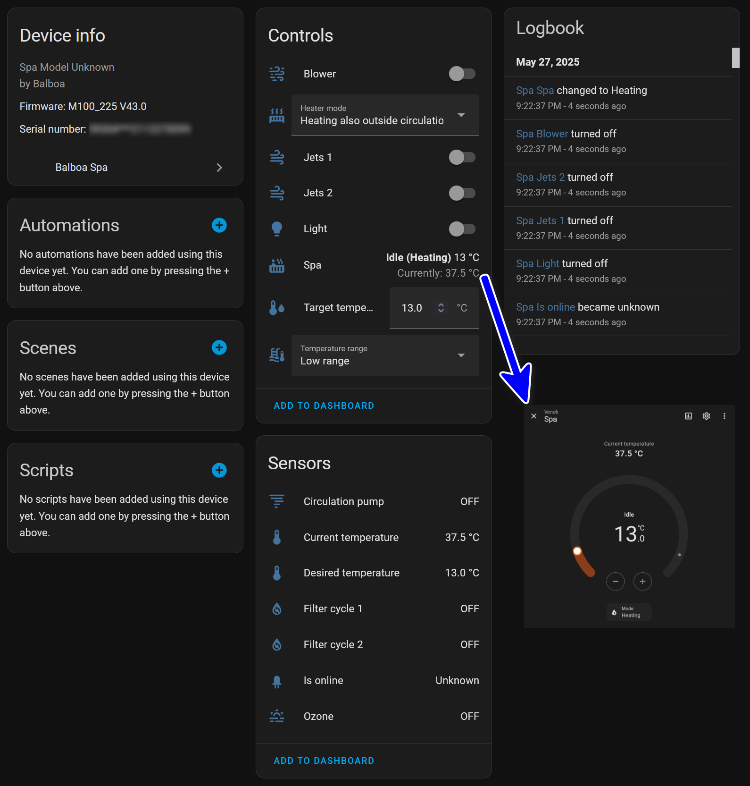

# ControlMySpa Hares for Home Assistant (experimental)

This component allows integration and control of hot tubs through the Home Assistant platform. It provides features not available in standard integrations and is intended for users with specific needs or those who want to test new functionalities.

If you like it, 

## How It Works

When you change a state in Home Assistant, the request is sent to the cloud service. The system waits approximately 2 seconds for a response (or up to 4 seconds, as the request is sent twice for reliability). If the change was successful, it will be reflected in Home Assistant.

In detail: The request is sent to the cloud, which forwards it to your spa. The spa responds with confirmation of the change, and the cloud then responds back to Home Assistant with the updated state. The request path is long because it's not a local transmission - it goes through the cloud infrastructure.

This function simulates the mobile application, where changes also take time to process. Please be patient when making changes, as the communication path involves multiple steps through the cloud service.

## What This Component Contains

This integration provides comprehensive monitoring and control of your hot tub through Home Assistant. It creates various entities including sensors, switches, climate controls, and light entities that allow you to monitor and control all aspects of your spa.

### Main Features: 

- **Hot tub status monitoring**:
  - Display of current water temperature.
  - Display of target water temperature.
  - Information about the status of the circulation pump, lights, heaters, filters, ozone generators, and other components.

- **Hot tub control**:
  - Setting the desired water temperature.
  - Switching between high and low temperature ranges.
  - Control of lights, pumps, blowers, and air bubbles.
  - Filter cycle scheduling and management.

- **Energy monitoring**:
  - Detailed energy consumption tracking for all major components.
  - Integration with Home Assistant Energy Dashboard.

- **Chromazone external lighting**:
  - Full control of external Chromazone lighting system.
  - Multi-zone support with individual zone control.

- **Automation**:
  - Integration with Home Assistant automations to schedule and manage the hot tub based on conditions such as time, weather, or user presence.

## Energy Monitoring

This component includes comprehensive energy monitoring capabilities that integrate seamlessly with Home Assistant's Energy Dashboard. The integration tracks energy consumption for all major hot tub components.

### Available Energy Sensors:

- **Heater Energy Sensors**: Track energy consumption of heating elements (kWh)
- **Pump Energy Sensors**: Monitor energy usage of all pumps (kWh)
- **Blower Energy Sensors**: Track energy consumption of air blowers (kWh)
- **Circulation Pump Energy Sensors**: Monitor circulation pump energy usage (kWh)

### How It Works:

Each energy sensor calculates consumption based on:
- Component power rating (configurable in integration options)
- Actual runtime of the component
- Automatic accumulation of total energy consumption

The sensors use the `TOTAL_INCREASING` state class, making them compatible with Home Assistant's Energy Dashboard. You can configure the power consumption (in watts) for each component type in the integration options to ensure accurate energy calculations.

### Configuration:

During integration setup, you can configure the power consumption for:
- Individual heaters (default: 2800W)
- Individual pumps (default: 2200W)
- Individual blowers (default: 1500W)
- Circulation pumps (default: 200W)

These values are used to calculate energy consumption based on the actual runtime of each component.

## Chromazone External Lighting

The component provides full control over the Chromazone external lighting system, allowing you to manage lighting zones, colors, brightness, and special effects directly from Home Assistant.

### Features:

- **Power Control**: Master switch to turn Chromazone lighting on/off
- **Multi-Zone Support**: Independent control of multiple lighting zones (Zone A, B, C)
- **Light Entities**: Full RGB color control with brightness adjustment for each zone
- **Zone Modes**: Select from various lighting modes:
  - **OFF**: Zone is turned off
  - **NORMAL**: Standard lighting mode
  - **PARTY**: Party mode with dynamic color effects
  - **RELAX**: Relaxing color transitions
  - **WHEEL**: Color wheel mode with smooth transitions
- **Color Selection**: Choose from predefined favorite colors or use RGB color picker
- **Brightness Control**: Adjust intensity from 0 (off) to 8 (maximum)
- **Speed Control**: Control color transition speed from 0 (off) to 5 (maximum)

### Available Entities:

For each Chromazone zone, the integration creates:
- **Switch**: Master power control for Chromazone system
- **Light Entity**: RGB light control with color and brightness
- **Select Entities**: 
  - Zone mode selector (OFF, NORMAL, PARTY, RELAX, WHEEL)
  - Color selector (predefined colors)
  - Intensity selector (0-8)
  - Speed selector (0-5)

### Usage:

You can control Chromazone lighting through:
- Home Assistant UI (Lovelace cards)
- Automations and scripts
- Voice assistants (Google Home, Alexa)
- Home Assistant mobile app

## Warning:
This component is experimental and may include features that are not fully tested. Use at your own risk.  
This is my first project for Home Assistant. Please be patient regarding functionality and any shortcomings. If you encounter bugs or have suggestions for improvement, feel free to contact me or create an issue on GitHub. Thank you for your understanding and support!

## Register the component as a HACS custom repository

If you want to add this component via HACS (Home Assistant Community Store), follow these steps:

1. Open Home Assistant and go to **HACS** → **Integrations**.
2. Click **Menu** (3 dots in the upper right corner) → **Custom repositories**.
3. Enter the repository URL https://github.com/haresik/Hares-ControlMySpa.git in the **Repository** field.
4. In the **Category** field, select **Integration**.
5. Click **Add**.

After adding the repository, the component will appear in the standard list of integrations, and you can install it directly from there.
***

# ControlMySpa Hares pro Home Assistant (experimentální)

Tato komponenta umožňuje integraci a ovládání vířivek prostřednictvím platformy Home Assistant. Poskytuje funkce, které nejsou dostupné ve standardních integracích, a je určena pro uživatele s konkrétními potřebami nebo pro ty, kteří chtějí testovat nové funkce.

## Jak to funguje

Při změně stavu v Home Assistantu se požadavek odešle do cloudové služby. Systém počká přibližně 2 sekundy na odpověď (nebo až 4 sekundy, protože se požadavek pro spolehlivost posílá dvakrát). Pokud změna proběhla úspěšně, projeví se v Home Assistantu.

Podrobněji: Požadavek se odešle do cloudu, který jej přepošle do vaší vířivky. Vířivka odpoví potvrzením změny a cloud pak odpoví zpět do Home Assistantu se změněným stavem. Cesta přenosu požadavku je dlouhá, protože nejde o lokální přenos - prochází cloudovou infrastrukturou.

Tato funkce simuluje mobilní aplikaci, kde také probíhají změny zdlouhavě. Při provádění změn buďte prosím trpěliví, protože komunikační cesta zahrnuje několik kroků přes cloudovou službu.

## Co tato komponenta obsahuje

Tato integrace poskytuje komplexní monitorování a ovládání vaší vířivky prostřednictvím Home Assistantu. Vytváří různé entity včetně senzorů, přepínačů, klimatických ovládání a světelných entit, které vám umožňují monitorovat a ovládat všechny aspekty vaší vířivky.

### Hlavní funkce:

- **Monitorování stavu vířivky**:
  - Zobrazení aktuální teploty vody.
  - Zobrazení požadované teploty vody.
  - Informace o stavu cirkulačního čerpadla, světel, topení, filtrů, ozonových generátorů a dalších komponent.

- **Ovládání vířivky**:
  - Nastavení požadované teploty vody.
  - Přepínání mezi vysokým a nízkým teplotním rozsahem.
  - Ovládání světel, čerpadel, blowrů a vzduchových bublin.
  - Plánování a správa filtračních cyklů.

- **Sledování energie**:
  - Detailní sledování spotřeby energie pro všechny hlavní komponenty.
  - Integrace s Energy Dashboard v Home Assistantu.

- **Externí osvětlení Chromazone**:
  - Plné ovládání externího osvětlovacího systému Chromazone.
  - Podpora více zón s individuálním ovládáním zón.

- **Automatizace**:
  - Možnost integrace s automatizacemi Home Assistantu pro plánování a řízení vířivky na základě podmínek, jako je čas, počasí nebo přítomnost uživatelů.

## Sledování energie

Tato komponenta zahrnuje komplexní možnosti sledování energie, které se bezproblémově integrují s Energy Dashboard v Home Assistantu. Integrace sleduje spotřebu energie pro všechny hlavní komponenty vířivky.

### Dostupné energetické senzory:

- **Senzory energie topení**: Sledují spotřebu energie topných prvků (kWh)
- **Senzory energie čerpadel**: Monitorují spotřebu energie všech čerpadel (kWh)
- **Senzory energie blowrů**: Sledují spotřebu energie vzduchových blowrů (kWh)
- **Senzory energie cirkulačních čerpadel**: Monitorují spotřebu energie cirkulačních čerpadel (kWh)

### Jak to funguje:

Každý energetický senzor počítá spotřebu na základě:
- Jmenovitého výkonu komponenty (konfigurovatelné v nastavení integrace)
- Skutečné doby provozu komponenty
- Automatického sčítání celkové spotřeby energie

Senzory používají třídu stavu `TOTAL_INCREASING`, což je činí kompatibilními s Energy Dashboard v Home Assistantu. Můžete nakonfigurovat spotřebu energie (ve wattech) pro každý typ komponenty v nastavení integrace, abyste zajistili přesné výpočty spotřeby energie.

### Konfigurace:

Během nastavení integrace můžete nakonfigurovat spotřebu energie pro:
- Jednotlivá topení (výchozí: 2800W)
- Jednotlivá čerpadla (výchozí: 2200W)
- Jednotlivé blowry (výchozí: 1500W)
- Cirkulační čerpadla (výchozí: 200W)

Tyto hodnoty se používají k výpočtu spotřeby energie na základě skutečné doby provozu každé komponenty.

## Externí osvětlení Chromazone

Komponenta poskytuje plné ovládání externího osvětlovacího systému Chromazone, což vám umožňuje spravovat osvětlovací zóny, barvy, jas a speciální efekty přímo z Home Assistantu.

### Funkce:

- **Ovládání napájení**: Hlavní přepínač pro zapnutí/vypnutí osvětlení Chromazone
- **Podpora více zón**: Nezávislé ovládání více osvětlovacích zón (Zóna A, B, C)
- **Světelné entity**: Plné RGB ovládání barev s nastavením jasu pro každou zónu
- **Režimy zón**: Výběr z různých osvětlovacích režimů:
  - **OFF**: Zóna je vypnutá
  - **NORMAL**: Standardní režim osvětlení
  - **PARTY**: Párty režim s dynamickými barevnými efekty
  - **RELAX**: Relaxační barevné přechody
  - **WHEEL**: Režim barevného kola s plynulými přechody
- **Výběr barvy**: Výběr z předdefinovaných oblíbených barev nebo použití RGB výběru barev
- **Ovládání jasu**: Nastavení intenzity od 0 (vypnuto) do 8 (maximum)
- **Ovládání rychlosti**: Ovládání rychlosti přechodu barev od 0 (vypnuto) do 5 (maximum)

### Dostupné entity:

Pro každou zónu Chromazone integrace vytváří:
- **Přepínač**: Hlavní ovládání napájení systému Chromazone
- **Světelná entity**: RGB ovládání světla s barvou a jasem
- **Select entity**: 
  - Výběr režimu zóny (OFF, NORMAL, PARTY, RELAX, WHEEL)
  - Výběr barvy (předdefinované barvy)
  - Výběr intenzity (0-8)
  - Výběr rychlosti (0-5)

### Použití:

Osvětlení Chromazone můžete ovládat prostřednictvím:
- Uživatelského rozhraní Home Assistantu (Lovelace karty)
- Automatizací a skriptů
- Hlasových asistentů (Google Home, Alexa)
- Mobilní aplikace Home Assistant

## Upozornění:
Tato komponenta je experimentální a může obsahovat funkce, které nejsou plně otestovány. Používejte ji na vlastní riziko.
Toto je můj první projekt pro Home Assistant. Prosím o schovívavost ohledně funkčnosti a případných nedostatků. Pokud narazíte na chyby nebo máte návrhy na zlepšení, neváhejte mě kontaktovat nebo vytvořit issue na GitHubu. Děkuji za pochopení a podporu!

## Zaregistrovat komponentu jako HACS custom repository

Pokud chcete tuto komponentu přidat prostřednictvím HACS (Home Assistant Community Store), postupujte podle následujících kroků:

1. Otevřete Home Assistant a přejděte do **HACS** → **Integrations**.
2. Klikněte na **Menu** (3 tečky v pravém horním rohu) → **Custom repositories**.
3. Do pole **Repository** zadejte URL https://github.com/haresik/Hares-ControlMySpa.git repozitáře.
4. V poli **Category** vyberte možnost **Integration**.
5. Klikněte na **Add**.

Po přidání repozitáře se komponenta objeví ve standardním seznamu integrací a můžete ji nainstalovat přímo odtud.
